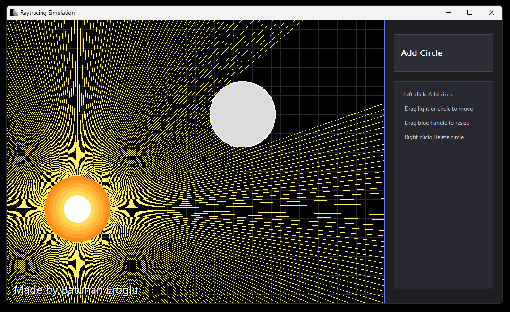

# Raytrace Simulation



## Overview

This app is an interactive editor that lets you visualize real-time light propagation. You can observe how a light source interacts with surrounding objects and see how light and shadows change dynamically as you place geometric shapes. The application demonstrates classic ray tracing algorithms in a 2D environment in a vivid and interactive way.

This project is designed as an excellent learning tool for those who want to understand fundamental concepts of computer graphics. With a user-friendly interface and real-time feedback, you can experiment with light, shadow, and ray casting concepts.

## For Developers

### Requirements

- Windows operating system
- C++ compiler such as MinGW or MSVC
- Windows API (windows.h) support

### Build

Use the following command to compile the project:

```bash
g++ main.cpp -o raytracer.exe -lgdi32 -luser32 -mwindows
```

Or with MSVC:

```bash
cl main.cpp /Fe:raytracer.exe user32.lib gdi32.lib
```

### Running

After compilation is complete, you can run the program directly:

```bash
.\raytracer.exe
```

### Usage

- **Left Click:** Add a new circle by clicking on an empty area
- **Drag:** Move the light source or shapes by dragging them
- **Blue Handle:** Drag the blue circle handle to resize the selected shape
- **Right Click:** Delete a shape by right-clicking on it

### Code Structure

- `Shape` class: Represents geometric shapes and ray-shape intersection tests
- `Render()` function: Draws the entire scene, handles ray casting and visual elements
- `WindowProc()`: Manages user input and handles mouse events
- Ray casting loop: Casts rays 360 degrees from the light source and calculates collisions

### Customizable Parameters

Customize the program by changing the following values in the code:

- `canvas_width` and `canvas_height`: Size of the drawing area
- `SIDEBAR_WIDTH`: Width of the control panel on the right side
- Ray count (360): Adjust visual quality with more or fewer rays
- Grid size (20px): Change the density of grid segments
